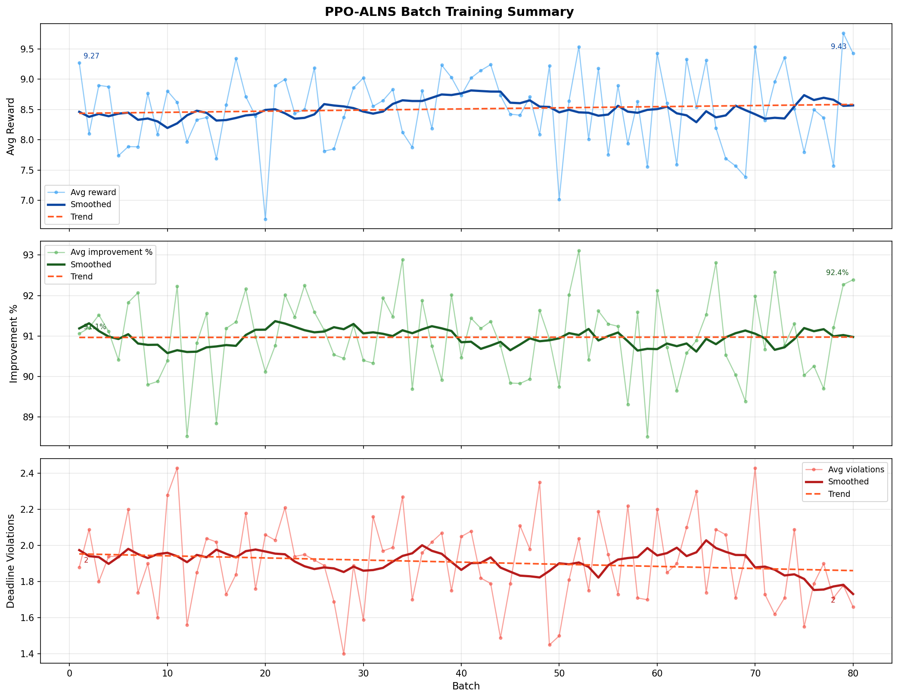
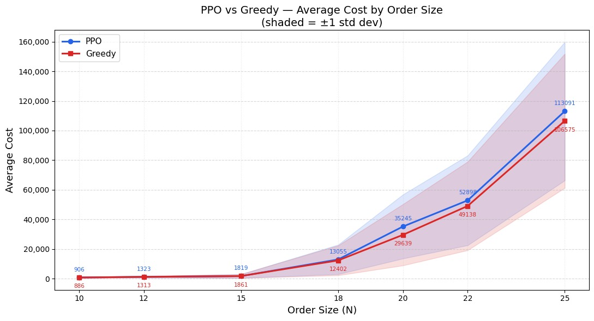
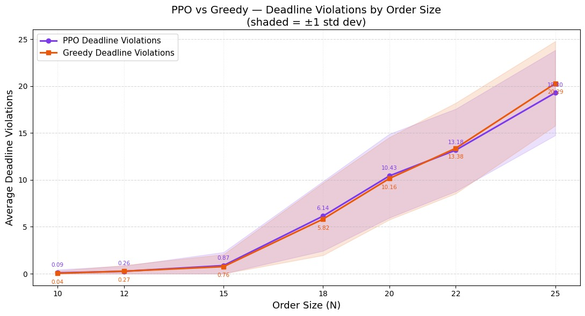

# VahanSetu — Smart Reverse Auction Logistics Platform

**National Institute of Technology Patna · Department of Computer Science and Engineering**  
Final Project · March 2026

> **Status:** ML/optimization core complete (models_v5). Full platform (frontend, backend, auction engine) is under active development.

**Supervisor:** Dr. Antriksh Goswami, Assistant Professor, CSE, NIT Patna  
**Team:** Shubham Kumar (2306217) · Asad Alim (2306222) · Priyanshu Kumar (2306227)

---

## Overview

VahanSetu is an intelligent logistics platform that addresses a fundamental coordination failure in India's freight market: commercial vehicles travelling on scheduled routes carry unused capacity, while shippers with item-level consignments have no efficient or fair way to match with compatible carriers.

Customers post shipment requests; transporters competitively bid to fulfil them through a **reverse auction mechanism**. The platform uses machine learning for route optimisation and price prediction, real-time WebSocket communication for live bidding, and an escrow-based payment system for secure transactions.

Unlike existing platforms (TruckSuvidha, BlackBuck) that focus only on full truckload bookings, VahanSetu enables **item-level dynamic matching** — inserting a new shipment into a carrier already en route — reducing costs for both sides and lowering carbon emissions from partial loads.

### Three-Service Architecture

```
/client       → React frontend
/server       → Node.js + Express backend
/ml-service   → FastAPI + PPO-ALNS Python microservice
```

---

## 6-Phase Platform Workflow

| Phase | Description |
|---|---|
| I — Shipment Posting | Customer posts package details; XGBoost predicts auction base price; customer pays 10% token deposit into escrow |
| II — Courier Filtering | NPI algorithm filters by spatio-temporal proximity; PPO-ALNS evaluates route insertion feasibility and ranks by detour cost |
| III — Auction Broadcast | Top 50 couriers invited; cascade fallback extends invites if participation falls below threshold |
| IV — Reverse Auction | Couriers bid below XGBoost base price; personalised break-even warning shown per courier |
| V — Bid Evaluation | Composite score (price + rating + performance + aging boost) ranks all bids; winner selected automatically |
| VI — Delivery Execution | Escrow releases 33.3% at pickup confirmation, 66.7% at delivery; privacy-aware tracking throughout |

---

## Algorithms

### PPO-ALNS for PDVRPTW

Based on Wang et al. (2025), *Journal of Combinatorial Optimization* 50:35.  
Extended from VRPTW to **PDVRPTW** — each order has both a pickup and delivery location, pickup must precede delivery, and separate time windows apply to both. This makes it a significantly harder problem than the original formulation.

**Two roles in the pipeline:**
1. **Courier filter (final stage):** Inserts the new shipment into each candidate's existing route and computes Δd (detour distance) and Δt (detour time) for ranking
2. **Route optimisation:** Produces an improved full route for the winning courier

**Architecture:**
- **Warm start** — OR-Tools (Parallel Cheapest Insertion + Guided Local Search) generates a feasible initial solution; falls back to time-window sorted greedy insertion if no cache exists
- **ALNS loop** — destroy/repair operators modify the route; Simulated Annealing (τ_start=500, τ_end=5) controls acceptance
- **PPO agent** — a shared-trunk MLP (512 → 256 → 128, ReLU) with a policy head (softmax over 15 actions) and a value head (scalar)
- **State vector** — 17-dimensional normalised vector encoding: search progress, solution quality gap, operator usage history, time window tightness, vehicle specs, deadline violation rate

**Operators:**

| Type | Operators |
|---|---|
| Destroy (5) | Random, Worst-Cost, Shaw similarity, String, Route-Segment |
| Repair (3) | Greedy, Criticality-Based (tightest deadline first), Regret-2 |

**Cost function:**
```
c(x) = 1.0 × T_travel + 25.0 × L_lateness + 0.05 × E_carbon + 0.1 × F_fuel
     + 1e5 × (capacity violations)
```

**Reward function:**
```
R_t = γ × (c*_before − c_new) / max(c*_before, 1)   if global best improved
    = α × (c_prev − c_new) / c_init                  if local improvement
    = −β × |c_prev − c_new| / c_init                 otherwise

α=1.0, β=1.0, γ=2.5 — clipped to [−10, 10]

Terminal reward = 5.0 × (c_init − c_best)/c_init  +  1.0 × (1 − t*/T_max)
```

**Hyperparameters:**

| Parameter | Value |
|---|---|
| Policy network | MLP [512, 256, 128] |
| Learning rate | 3 × 10⁻⁴ (Adam) |
| Total batches | 80 |
| Steps per batch | 10,240 |
| Rollout buffer (n_steps) | 512 |
| Mini-batch size | 64 |
| Gradient updates per batch | 1,600 |
| γ (discount) | 0.99 |
| λ (GAE) | 0.95 |
| PPO clip ε | 0.2 |
| Entropy coefficient | 0.01 |
| T_max per episode | 50 |
| SA T_start / T_end | 500 / 5 |
| Total training time | ~9–10 hours (CPU) |

---

### XGBoost Price Predictor

Predicts the auction base price and a personalised break-even price for each courier.

| Parameter | Value |
|---|---|
| Trees | 100 (sequential) |
| Learning rate | 0.05 |
| Max depth | 4 |
| Subsample | 0.8 (instances + features per round) |
| Min child weight | 5 |
| Early stopping | 30 rounds without validation MAE improvement |

**R² > 0.95** on held-out test set.  
**Top features (SHAP):** `distance_km`, `toll_cost`, `area_type`, `demand_surge`, `vehicle_type`, `weight_kg`, `fuel_cost_per_liter`, `volume_m3`

---

### Node Proximity Index (NPI)

Bilateral spatio-temporal filter that shortlists transporters **before** the heavier PPO-ALNS evaluation. India's districts are modelled as a graph; days are divided into 6-hour intervals.

```
Algorithm:
1. Query vehicles passing through source district S at pickup time window  → V_S
2. Query vehicles passing through destination district D at delivery time window → V_D
3. Candidates C = V_S ∩ V_D
4. If |C| < threshold → expand to neighbouring districts and recompute
```

Unlike prior work that uses single-point proximity (source only), NPI matches against **both** pickup and delivery locations — a constraint required for inter-city freight but absent from existing literature.

---

### Composite Bid Scoring with Aging Boost

```
Score_i = [0.70 × P_i  +  0.20 × R_i  +  0.10 × X_i]  ×  (1 + AgingBoost_i)

P_i = 1 − (bid_i − MinBid) / (MaxBid − MinBid)          # price score
R_i = driverRating_i / 5.0                                # rating score
X_i = 0.60 × CompletionRate + 0.40 × OnTimeRate          # performance score

AgingBoost_i = (min(N_rating,i, 10) / 10) × (1 − e^(−α × L_i))
```

Where L_i = consecutive auction losses, α ∈ [0.05, 0.5] = aging rate.  
Inspired by aging in OS scheduling — prevents starvation of lower-rated but competitive couriers.

---

## Research Contributions

1. **Bilateral spatio-temporal carrier discovery (NPI)** — unlike prior work using single-point proximity, NPI matches carriers against both the pickup and delivery location within time windows
2. **PPO-ALNS extended to PDVRPTW** — Wang et al.'s original formulation addressed VRPTW (delivery only); this adds paired pickup-delivery precedence and hard per-stop capacity enforcement
3. **Composite scoring with aging boost** — addresses the "reputation trap" found in all prior logistics auction literature; no existing system incorporates starvation prevention
4. **Cascade broadcast** — if fewer than 50 couriers confirm, the next ranked batch is invited immediately; auction reschedules at inflated price if threshold cannot be met
5. **Privacy-aware tracking** — shipper sees courier's live location only when their node is the courier's immediate next stop, protecting route confidentiality for multi-stop deliveries
6. **Token-based escrow** — separates genuine shippers and couriers from bad-faith actors before any auction begins

---

## Token & Payment System

| Party | Token | Purpose |
|---|---|---|
| Shipper | 10% of base price | Ensures valid shipment posting |
| Courier | min(5% of base price, ₹1,500) | Ensures genuine bid participation |

Payment milestones: **33.3%** released at pickup confirmation · **66.7%** at delivery · **2% platform fee** paid by shipper · courier token fully refunded on successful delivery.

---

## Experimental Results

### PPO-ALNS Training (80 batches, ~16,400 episodes)

- Reward stabilises near **8.5** after batch ~56 (convergence plateau)
- Average route improvement over initial greedy: **~91%**
- Deadline violations reduced from **1.95 → 1.88** (meaningful given 25× lateness penalty weight)
- At N=25 orders, PPO-ALNS produces **fewer deadline violations** than random-operator greedy baseline (19.30 vs 20.29)



### Benchmark: PPO vs Greedy





### End-to-End Simulation (3 runs × 5 drivers)

| Run | Best detour (km) | Break-even (₹) | Avg baseline (₹) | Customer saving (₹) |
|---|---|---|---|---|
| Run 1 | 219.56 | 5,768.75 | 6,063 | 294.25 |
| Run 2 | 130.92 | 3,482.69 | 4,660 | 1,177.31 |
| Run 3 | 385.20 | 5,249.25 | 5,895 | 645.75 |

In all three runs, the best-matched driver's break-even cost was lower than the dedicated single-vehicle baseline — confirming the core value proposition of load consolidation.

---

## Tech Stack

**Frontend**
- React (Vite), Tailwind CSS
- Socket.io-client (real-time bid updates)
- react-leaflet + Leaflet.js (route maps, OpenStreetMap)
- React Router, Axios

**Backend**
- Node.js + Express, MongoDB + Mongoose
- JWT (role-based auth: customer / transporter)
- Socket.io (WebSocket auction rooms per shipment)
- Razorpay (payments with HMAC-SHA256 verification)
- Multer (shipment document uploads)

**ML Microservice**
- FastAPI + Uvicorn
- PPO-ALNS PDVRPTW model (NumPy, CPU)
- OR-Tools (warm-start cache)
- XGBoost, Stable-Baselines3, Gymnasium

---

## Dataset

300 synthetic PDVRPTW instances across the Delhi NCR region, covering order sizes 3–25 (10 tiers, 30 instances/tier, 3 geographic zones). Built from scratch — existing VRPTW benchmarks (Solomon, Li & Lim) are structurally incompatible with paired pickup-delivery constraints and produced >50% deadline violations when adapted.

Each instance includes:
- `instances/INST{id}_N{orders}_{zone}.json` — order details, time windows, vehicle specs
- `matrices/INST{id}_distance_km.csv` — distance matrix (km)
- `matrices/INST{id}_time_min.csv` — travel time matrix (minutes)

Zone suffix: `N` = North Delhi NCR · `W` = West · `S` = South

---

## Project Structure

```
vahansetu-ml/
├── src/
│   ├── alns_env.py          # Gymnasium environment — PPO training loop, reward, state
│   ├── alns_operators.py    # Destroy and repair operators
│   ├── constraints.py       # Feasibility checks, route metrics, schedule formatter
│   ├── constants.py         # Single source of truth for cost weights
│   ├── data_loader.py       # Dataset loading, vehicle augmentation
│   ├── main.py              # Demo runner — greedy ALNS vs PPO-ALNS
│   ├── train.py             # Batch PPO training with logging
│   ├── benchmark.py         # 25-run greedy vs PPO comparison
│   ├── presolve.py          # OR-Tools warm-start cache generator
│   ├── visualizer.py        # Route plots, cost breakdown charts
│   └── outputs/
│       └── batch_summary.png
│
├── data/
│   └── dataset_v3/
│       ├── instances/       # 300 JSON instance files
│       └── matrices/        # 600 CSV distance/time matrices
│
├── models_v5/               # Latest trained model checkpoints
├── logs_v5/                 # Latest training logs
│
├── notebooks/
│   └── BasePrice_xgBoost.ipynb
│
├── .gitignore
├── requirements.txt
└── README.md
```

---

## Setup (ML Core)

**Requirements:** Python 3.10+

```bash
git clone https://github.com/Asad-Alim/vahansetu-ml.git
cd vahansetu-ml
pip install -r requirements.txt
```

**Generate OR-Tools warm-start cache (optional but recommended):**
```bash
python src/presolve.py --data_dir data/dataset_v3 --cache_dir data/or_cache
```

**Run demo (greedy ALNS baseline):**
```bash
python src/main.py --data_dir data/dataset_v3
```

**Run with trained PPO model:**
```bash
python src/main.py --data_dir data/dataset_v3 --use_ppo --model_path models_v5/ppo_alns_final
```

**Train from scratch:**
```bash
python src/train.py --data_dir data/dataset_v3 --batches 80 --minutes_per_batch 30
```

**Run benchmark (greedy vs PPO, 25 runs):**
```bash
python src/benchmark.py --data_dir data/dataset_v3 --runs 25
```

---

## References

- Wang et al. (2025). Reinforcement Learning Guided ALNS for VRPTW. *Journal of Combinatorial Optimization, 50(4).*
- Chen & Guestrin (2016). XGBoost: A Scalable Tree Boosting System. *KDD '16.*
- Schulman et al. (2017). Proximal Policy Optimization Algorithms. *arXiv:1707.06347.*
- Ropke & Pisinger (2006). ALNS for pickup and delivery with time windows. *Transportation Science, 40(4).*
- Google Optimization Team (2023). OR-Tools.
- Solomon (1987). Algorithms for VRPTW. *Operations Research, 35(2).*
- Li & Lim (2003). Metaheuristic for pickup and delivery with time windows. *IJAIT, 12(2).*